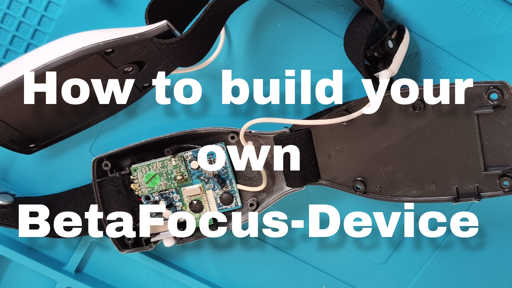

Quick-Start Anleitung und Video Tutorial

[Zum Video](https://youtu.be/HeGSPaNe2Dc)  

Um direkt loslegen zu können:
1. **Schalter [TIMESTAMP] auf AUS und BetaFocus-Device auf AUS. Verbinde ESP32 per USB mit PC**  damit RX vom ESP32 und TX vom Mikrocontroller nicht verbunden sind, während des Uploads (denn sonst funktioniert es nicht)   
2.  **Sketch uploaden mit ArduinoIDE:** siehe [Github](https://github.com/visar77/BetaFocus/tree/main/Arduino%20Sketches) 
    1. Mit unserem Display: display_128x64_bluetooth_arduino_sketch.ino [hier](https://github.com/visar77/BetaFocus/blob/main/Arduino%20Sketches/README.de.md#display_128x64_bluetooth_arduino_sketchino) 
    2. Ohne Display: bluetooth_arduino_sketch.ino [hier](https://github.com/visar77/BetaFocus/blob/main/Arduino%20Sketches/README.de.md#bluetooth_arduino_sketchino)
3. **Verbindung zwischen PC und USB trennen (ACHTUNG: PC SOLLTE NICHT MIT BETAFOCUS-DEVICE VERBUNDEN SEIN WÄHREND BENUTZUNG)**
4. **Schalter auf AN und BetaFocus-Device AN**
5. **Verbinde PC per Bluetooth mit "BetaFocus Device"** → Es werden zwei serielle Ports auf dem Rechner kreiert, welche die Bluetooth-Verbindung darstellen  
6. **Wähle in der Software (GUI) unter "Verbinden" den Eingangs-Port aus**
7. **Setze das "BetaFocus Device" auf und befestige die Klemmen an den Ohren**
8. **Starte die Session**

FAQs

Wie funktioniert das mobile Hirnwellenmessgerät?

Siehe Info-Seite [LINK]

Ist BetaFocus sicher?

Das Spielzeug "MindFlex" wurde von Mattel konzipiert und getestet und gilt demnach als sicher. Alle vorgenommenen Änderungen, wie im Video dargestellt, geschehen auf eigenem Risiko. 
**WICHTIG:** Das Gerät darf NIEMALS mit einem Kabel verbunden sein, während man es auf dem Kopf trägt. (Dies beinhaltet bspw. die Verbindung per USB-Kabel zum PC, etc.)

Wie genau sind die Messungen?

Siehe Info-Seite [LINK]

Welche Art von Daten kann ich erwarten?

Serielle Zahlenwerte für die Signalqualität (0 - 100, wobei 0 sehr schlechte Signalqualität darstellt), Meditation (), Concentration (). Die Daten werden in einer CSV-Datei erfasst und über die Zeit gekennzeichnet.

Benötige ich spezielle Vorkenntnisse, um das Gerät zu verwenden?

Nein, mit Hilfe des Video-Tutorials und der Quick-Start-Anleitung sollte man problemlos erste Messungen starten können. Je öfter man das Gerät benutzt, desto intuitiver wird der Umgang.

Wie lange dauert eine typische Messung?

Die Dauer der Sessions ist nicht begrenzt, sollte aber für eine korrekte und sinnvolle Auswertung bei mindestens 5 Minuten liegen. Des Weiteren braucht man eine gewisse Zeit, bis man sich in einem konzentrierte Zustand befindet, daher können die ersten Minuten der Messung weniger aussageräftig sein.

Kann das Gerät mit meinem Smartphone oder Tablet verbunden werden?

Es ist möglich aber nicht sinnvoll, da noch keine BetaFocus App existiert, mit der man Asuwertungen betreiben kann. Man kann allerdings eine Verbindung zum Gerät herstellen und die seriellen Werte beobachten.

Welche Betriebssysteme werden unterstützt?

WINDOWS, LINUX und MAC wurden getestet und werden von unserer Software unterstützt.

Kann ich die Daten mit anderen Geräten oder Plattformen teilen?

Da die Daten im CSV-Format vorliegen kann man sie problemlos mit anderen Plattformen, Apps oder Geräten teilen. Allerdings liegen die Daten dann im Rohformat vor und sind nicht optimiert, um in anderer Software als BetaFocus verwendet zu werden.   
Es existiert außerdem noch keine Funktion, um die Messwerte anschaulich zu exportieren oder zu teilen.

Wie wird die Privatsphäre meiner Daten geschützt?

Alles ist lokal auf dem eigenen Rechner gespeichert, daher sind Nutzende selbst für die Sicherheit ihrer Daten verantwortlich.

  

