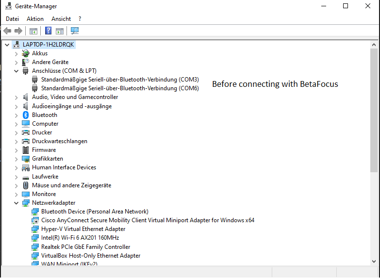
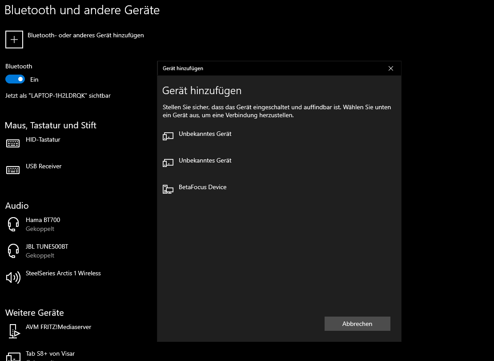
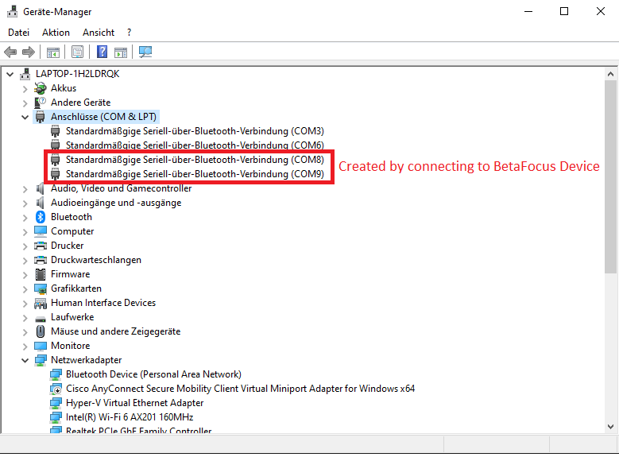
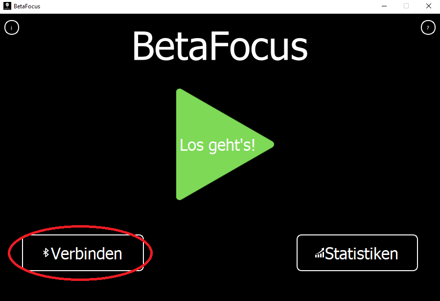
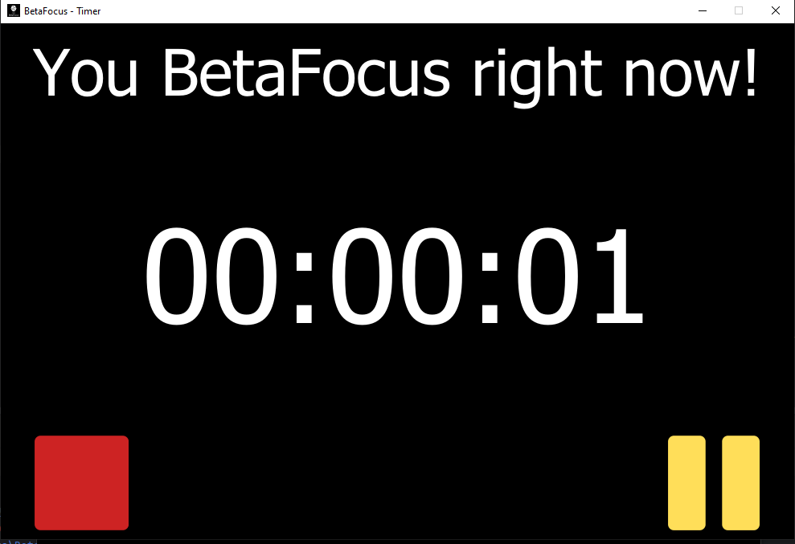
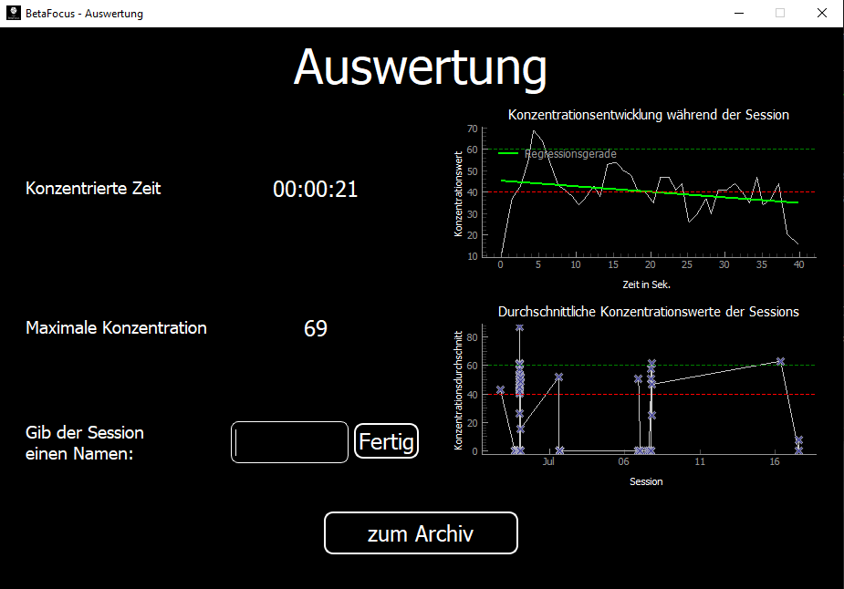
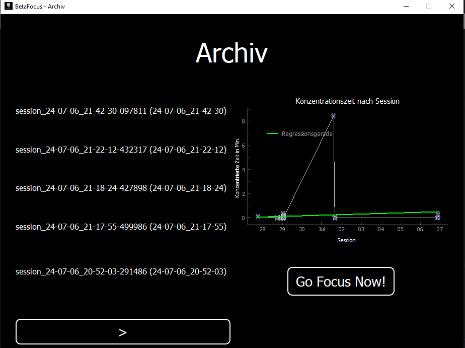
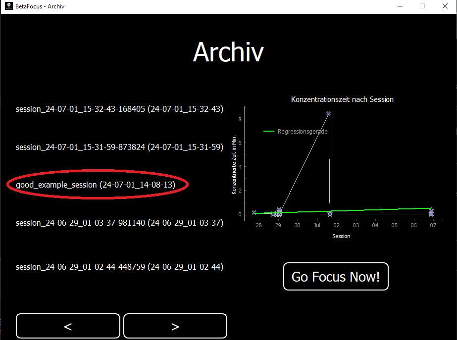
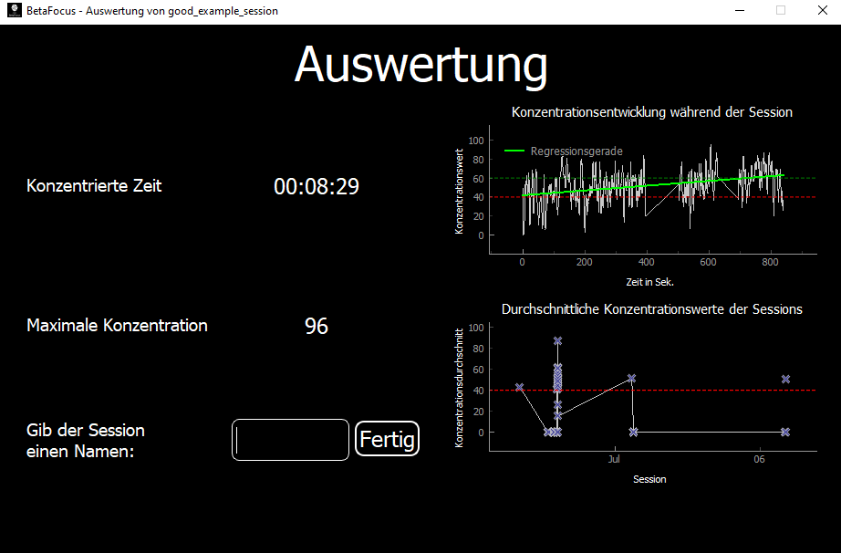

# BetaFocus
[](https://github.com/visar77/BetaFocus/blob/main/README.de.md)
[](https://github.com/visar77/BetaFocus/blob/main/README.md)

## Informationen über das Projekt
BetaFocus ist ein Projekt, das das Mindflex-EEG-Spielzeug von Mattel verwendet, um die Konzentration zu messen und diese in Echtzeit zu visualisieren.

Das Projekt ist in zwei Teile gegliedert:
die Hardware, die darin besteht, das Mindflex-Spielzeug zu hacken und es mit einem Mikrocontroller zu verbinden, und den Softwareteil, der die Aufmerksamkeitsdaten visualisiert.

Dieses README wurde auf Deutsch und Englisch verfasst. Wenn Sie die deutsche Version sehen möchten, klicken Sie [hier](https://github.com/visar77/BetaFocus/blob/main/README.de.md) oder klicken Sie auf das Abzeichen unter dem Titel.

## Einrichtung
### 1. Einrichtung des BetaFocus-Geräts
1. Kaufen Sie ein Mindflex-EEG-Spielzeug von Mattel. Da diese nicht mehr produziert werden, müssen Sie eines von Ebay oder ähnlichen Plattformen besorgen.
2. Besorgen Sie sich einen Mikrocontroller (Arduino Uno, Nano usw.) mit Bluetooth (nicht BLE!).
3. (Optional) Besorgen Sie sich ein 128x64 oder 128x32 OLED-Display mit I2C-Schnittstelle.
4. Folgen Sie unserem Youtube-Tutorial, um das Mindflex-Spielzeug zu hacken und es mit einem Arduino zu verbinden: [Extrem cooles Video](https://youtube.com/HeGSPaNe2Dc)

Leider wird das BetaFocus-Gerät mit einem Display nicht lange halten, da die Stromversorgung von 4,5 V nach 10 Stunden Nutzung die 3,3 V Marke erreichen wird. 
Um die Batterielebensdauer zu maximieren, wäre es am besten, das Gerät ohne Display zu verwenden.

### 2. Sketch auf den Mikrocontroller hochladen
1. Lesen Sie das [Arduino-Readme](https://github.com/visar77/BetaFocus/blob/main/Arduino%20Sketches/README.md) und wählen Sie den richtigen Arduino-Sketch aus.
2. Laden Sie den Sketch über die Arduino IDE oder PlatformIO (VS Code) auf den Mikrocontroller hoch.
3. Fertig!

### 3. Installation
#### Ohne Installation
```shell
git clone https://github.com/visar77/BetaFocus.git
cd BetaFocus/BetaFocus/src
pip install pyserial pyqt5 pyqtgraph pyqtwebengine pandas 
python3 main.py
```

#### Release-Installation
(In Entwicklung)

## Bedienung der Software
### Starten und Stoppen einer Session unter Windows 10
1. Öffnen Sie den Geräte-Manager 
2. Verbinden Sie sich über Bluetooth mit dem BetaFocus-Gerät 
3. Schauen Sie sich den geöffneten COM-Port an und merken Sie sich die Nummer 
4. Öffnen Sie die BetaFocus-Software 
5. Gehen Sie zu Verbinden -> COM-Port und wählen Sie die COM-Port-Nummer aus

   - Da die Sketche zwei COM-Ports erstellen, müssen Sie überprüfen, welcher der richtige ist
   - Versuchen Sie, sich mit einem COM-Port zu verbinden und starten Sie eine Session (siehe Schritt 6). Wenn nach 10 Sekunden ein Timeout-Fehler auftritt, dann haben Sie den falschen COM-Port ausgewählt und der andere ist der richtige
   
6. Setzen Sie das Headset auf und klicken Sie auf "Los geht's", um eine Session zu starten
   
7. Stoppen Sie die Session, indem Sie auf das rote Quadrat klicken

### Starten und Stoppen einer Session auf anderen Betriebssystemen
1. Verbinden Sie sich über Bluetooth mit dem BetaFocus-Gerät
2. Wählen Sie den richtigen Port aus, indem Sie die verfügbaren Ports ausprobieren, die in der Software angezeigt werden (Schritt 5 in der Anleitung für Windows 10)

### Auswertung der Sitzungsdaten
Nachdem eine Session gestoppt wurde, sehen Sie die Zeit in Sekunden, in denen Sie sich konzentriert haben (das bedeutet, dass der Konzentrationswert über 40 lag), den maximalen Konzentrationswert und die Konzentrationswerte über die Zeit mit einer Regressionslinie, die die Entwicklung der Konzentrationswerte in der Session anzeigt.
Zuletzt zeigt ein unteres Diagramm die durchschnittlichen Konzentrationswerte aller aufgezeichneten Sessions.
   

### Daten alter Sessions ansehen
1. Klicken Sie im Hauptfenster auf den Button "Statistik"
2. Sie sehen eine Liste aller aufgezeichneten Sessions und ein Diagramm der durchschnittlichen Konzentrationszeit aller Sessions 
3. Um die Daten einer bestimmten Session zu sehen, doppelklicken Sie auf die Session in der Liste  
4. Um den Namen einer Session zu ändern, schreiben Sie einen gültigen Namen in das Textfeld und klicken Sie auf "Fertig"

### Hilfe
Für weitere Informationen zur Nutzung des BetaFocus Device klicken Sie bitte auf den Fragezeichen im Hauptfenster oben rechts. Dort befindet sich eine ausführliche Anleitung zur Bedienung der Software im PDF-Format.
### Info
Die Wissenschaft hinter dem Mindflex-Spielzeug basiert auf der EEG-Technologie. Wir erklären die Technologie in unserem Info-PDF, das über den Info-Button im Hauptfenster oben links aufgerufen werden kann.

## Lizenzen von genutzten Komponenten bzw. Software-Bibliotheken
### Adafruit GFX and SSD1306 library
Ein besonderer Dank geht an die wunderbare Limor Fried (Ladyada) für die Bereitstellung der Open-Source-Software zur Steuerung von i2c- und spi-Minidisplays.
```
Software License Agreement (BSD License)

Copyright (c) 2012, Adafruit Industries
All rights reserved.

Redistribution and use in source and binary forms, with or without
modification, are permitted provided that the following conditions are met:
1. Redistributions of source code must retain the above copyright
notice, this list of conditions and the following disclaimer.
2. Redistributions in binary form must reproduce the above copyright
notice, this list of conditions and the following disclaimer in the
documentation and/or other materials provided with the distribution.
3. Neither the name of the copyright holders nor the
names of its contributors may be used to endorse or promote products
derived from this software without specific prior written permission.

THIS SOFTWARE IS PROVIDED BY THE COPYRIGHT HOLDERS ''AS IS'' AND ANY
EXPRESS OR IMPLIED WARRANTIES, INCLUDING, BUT NOT LIMITED TO, THE IMPLIED
WARRANTIES OF MERCHANTABILITY AND FITNESS FOR A PARTICULAR PURPOSE ARE
DISCLAIMED. IN NO EVENT SHALL THE COPYRIGHT HOLDER BE LIABLE FOR ANY
DIRECT, INDIRECT, INCIDENTAL, SPECIAL, EXEMPLARY, OR CONSEQUENTIAL DAMAGES
(INCLUDING, BUT NOT LIMITED TO, PROCUREMENT OF SUBSTITUTE GOODS OR SERVICES;
LOSS OF USE, DATA, OR PROFITS; OR BUSINESS INTERRUPTION) HOWEVER CAUSED AND
ON ANY THEORY OF LIABILITY, WHETHER IN CONTRACT, STRICT LIABILITY, OR TORT
(INCLUDING NEGLIGENCE OR OTHERWISE) ARISING IN ANY WAY OUT OF THE USE OF THIS
SOFTWARE, EVEN IF ADVISED OF THE POSSIBILITY OF SUCH DAMAGE.
```
## Danksagungen und Anerkennungen
Die Hauptinspiration für dieses Projekt war der Blog von Frontier Nerds, wo das Hacken von EEG-Spielzeug gezeigt wird: https://frontiernerds.com/brain-hack. 
Es ist verständlich geschrieben, einfach zu lesen und erklärt die Funktionsweise des NeuroSky-Moduls auch sehr gut.
Der Blog-Post wurde von Eric Mika geschrieben, einem NYU-Absolventen und derzeitigen Kreativdirektor von Local Projects (https://www.linkedin.com/in/emika/). <br>
Seine Arduino Brain Library https://github.com/kitschpatrol/Brain liest empfangene Pakete vom NeuroSky-EEG-Headsets auch aus und kann in Kombination mit BrainGrapher https://github.com/kitschpatrol/BrainGrapher die empfangenen Werte visualisieren. <br>
Dank Eric sind wir erst auf diese Idee gekommen und haben auf seinen Hack aufgebaut und diesen erweitert.